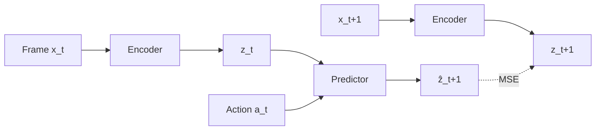
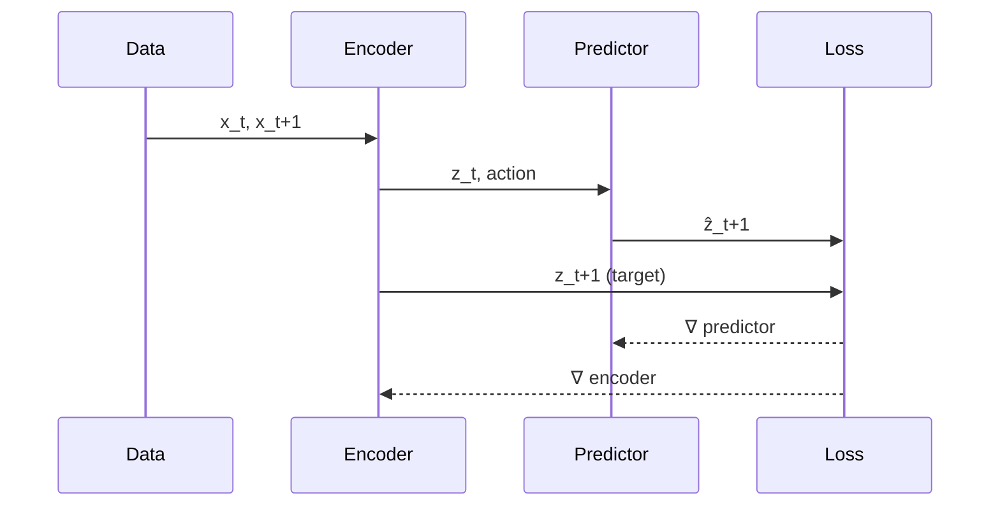
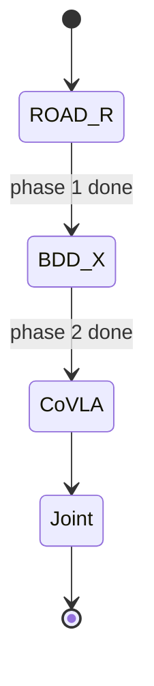

# wiki-diagram

You are turning a description into a clean, terse diagram inside a wiki page. Two output formats, picked from the intent:

- **Mermaid** — default. Renders natively in Obsidian and on GitHub. Lives as a fenced code block inside the host page. Versionable, diffable, AI-editable.
- **Excalidraw** — fallback for hand-drawn sketches and freeform layouts that Mermaid can't express. Lives as a sibling `figures/<slug>-<topic>.excalidraw.md` file. Renders in Obsidian via the Excalidraw plugin; **does not render on GitHub** (known tradeoff — only choose this when the sketch nature is the point).

## Input

Two forms:

1. `/wiki-diagram <page-slug> "<one-line description>"` — explicit target page.
2. `/wiki-diagram "<one-line description>"` — no target; ask which page should host it, or propose one if the description names an entity that maps to a page.

Confirm the target page before generating.

## Step 1 — Pick the diagram type

| Intent | Format | Mermaid block |
|---|---|---|
| Architecture / dataflow / pipeline | Mermaid | `flowchart LR` |
| Tree of options, decision branches | Mermaid | `flowchart TD` |
| Training or inference *loop* (temporal order) | Mermaid | `sequenceDiagram` |
| State machine, agent state, training phase transitions | Mermaid | `stateDiagram-v2` |
| Class / schema / ontology relationships | Mermaid | `classDiagram` |
| Roadmap / experiment timeline | Mermaid | `gantt` |
| Branching / experiment tree (git-shaped) | Mermaid | `gitGraph` |
| 2×2 / quadrant comparison | Mermaid | `quadrantChart` |
| Tabular comparison with ≤ 4 columns | **Not a diagram — use a markdown table** |
| Freeform sketch, mental model, hand-drawn aesthetic | Excalidraw | `.excalidraw.md` |

If the request is small enough to be a 3-row table, refuse to draw it. Markdown tables read better in both Obsidian and GitHub.

## Step 2a — If Mermaid: generate the block

Style rules (apply by default):

- **`flowchart LR`** for architectures and pipelines — reading-flow direction. `TD` only when the structure is a hierarchy/tree.
- **Box shapes carry meaning**: `[rect]` for components, `(round)` for transformations, `((circle))` for endpoints/IO, `{diamond}` for decisions.
- **Edge labels only when not obvious**. `A --> B` is fine; `A -->|extract z_t| B` only if the edge action isn't deducible from the boxes.
- **No colors** unless distinguishing two paths (training vs inference; constraint-satisfied vs violated). When using colors, use `classDef` blocks at the bottom, not inline styling.
- **Node count ≤ 12.** Past that, split into sub-diagrams or a nested `subgraph`.
- **Identifiers are short**: `enc`, `pred`, `z_t`, not `theEncoderModule`.

Template (architecture):

````markdown

````

Template (training loop, sequence):

````markdown

````

Template (training phases, state):

````markdown

````

Place the block inside the host page, immediately after the section header it illustrates. Common spots:

- Paper page: under `## Architecture` (create the section if missing).
- Method page: under `## Method` or `## Training`.
- Direction page: under `## Method`.
- Project page: under `## Pipeline` or top-of-page below the intro.

## Step 2b — If Excalidraw: create the stub file

Path: `<section>/figures/<slug>-<topic>.excalidraw.md` where `<section>` is the host page's parent dir.

Examples:
- Host `papers/maes-2026-lewm.md` + topic "architecture" → `papers/figures/maes-2026-lewm-architecture.excalidraw.md`
- Host `methods/wavlm-hier.md` + topic "hier-pooling" → `methods/figures/wavlm-hier-hier-pooling.excalidraw.md`

You cannot generate Excalidraw content (it's a JSON canvas). Create a stub file with the Obsidian-Excalidraw plugin frontmatter and a TODO comment, then embed it in the host page:

```markdown
---
excalidraw-plugin: parsed
tags: [excalidraw, diagram]
---

==⚠ Switch to EXCALIDRAW VIEW in the MORE OPTIONS menu of this document. ⚠==

# Excalidraw Data

## Text Elements

## Embedded Files

%%
# Drawing
```compressed-json
{}
```
%%
```

Then add a transclusion at the chosen spot in the host page:

```markdown
![[figures/<slug>-<topic>.excalidraw|800]]
```

Tell the user: *"Excalidraw stub created at `<path>`. Open it in Obsidian, switch to Excalidraw view, and draw. GitHub will not render this — only Obsidian readers see the figure."*

## Step 3 — Edit the host page

Use `Edit` to insert the Mermaid block (or Excalidraw transclusion) at the right H2 section. Don't create a `## Diagram` header — diagrams sit under the section they illustrate. If no fitting section exists, create one with a content-specific header (`## Architecture`, `## Training Loop`, `## Phase Schedule`), not `## Figure`.

If the host page's `updated:` frontmatter is older than today, bump it.

## Step 4 — Lint and report

```bash
python3 .claude/scripts/wiki.py lint
```

Mermaid blocks don't trip lint — they're plain markdown inside the page. Excalidraw files have `type: ` absent on purpose (they're not wiki entities); lint may flag them as `frontmatter-missing` or `field-missing`. If that happens, exclude them: add the `.excalidraw.md` suffix to `wiki.py`'s ignore list, or document the exclusion in the report. (Current behavior — verify before claiming clean.)

Report to the user in one line: `Added <type> diagram to <page-slug> under ## <Section>.`

## Hard rules

- **Do not draw what a table renders.** ≤ 4 columns × ≤ 6 rows → markdown table, not a diagram.
- **One diagram per request.** If the user describes a multi-diagram figure, propose splitting and confirm before generating more than one.
- **No emoji or decorative unicode in nodes.** Plain identifiers only.
- **Verify the host page exists** before editing. `wiki.py cite <slug>` confirms.
- **Excalidraw only when the sketch nature matters.** It's strictly less portable than Mermaid — pick it only if Mermaid can't express the idea.
- **Don't restyle existing diagrams** unless the request is explicitly to restyle. If a page already has a Mermaid block on the topic, update that block; don't add a second one.

## What to avoid

- Don't render the same content twice (table + diagram on the same data).
- Don't add subgraphs for two-node groupings — they add noise.
- Don't use `flowchart TD` for pipelines just because it's the Mermaid default — pipelines read `LR`.
- Don't suggest external tools (Lucidchart, draw.io SaaS, Whimsical). Anything that doesn't live in the repo as text or `.excalidraw.md` is out of scope.
