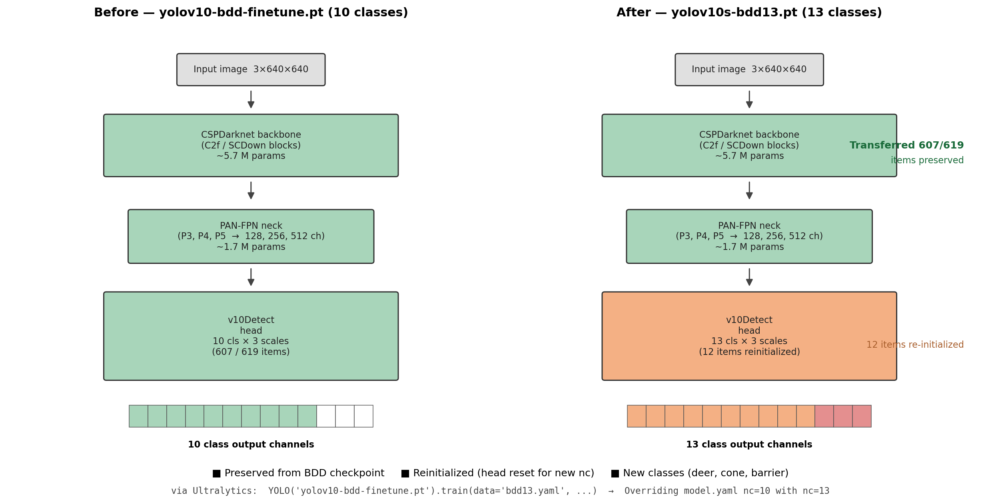
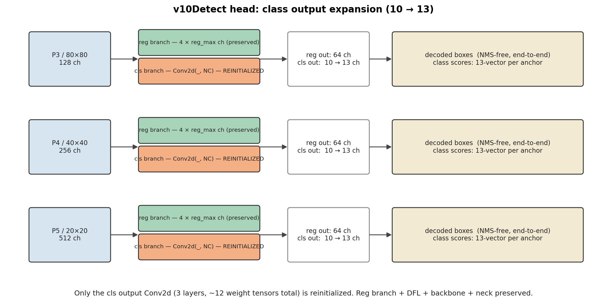

# YOLOv10-13 — Extending the AutoDrive BDD100K Detector

Extended the [[projects/yolo-bdd|YOLO_BDD]] YOLOv10s detector from BDD100K's 10 classes to **13 classes** by adding **deer**, **cone**, and **barrier** for the AutoDrivePerception2026 ROS pipeline. Final model: `yolov10s-bdd13/weights/best.pt` at **mAP50=0.602** across all 13 classes, with **no regression** on the original BDD-only metric (0.524 → 0.527).

**Best checkpoint:** epoch 42 / 50 — `/data/repos/YOLO_BDD/runs/detect/yolov10s-bdd13/weights/best.pt`

---

## Motivation

The AutoDrivePerception2026 ROS pipeline runs YOLOv10 + downstream traffic light / sign classifiers. The vehicle operates in a campus-and-rural environment where three road hazards beyond BDD's vocabulary matter:

- **Deer** — collision-relevant wildlife on rural NC highways
- **Cone** — construction zones and event detours
- **Barrier** — jersey/cement barriers separating active work zones

BDD100K's 10 classes (pedestrian, rider, car, truck, bus, train, motorcycle, bicycle, traffic light, traffic sign) cover the dense urban driving objects but miss all three. We extend the existing `yolov10-bdd-finetune.pt` checkpoint rather than retraining from scratch to preserve months of BDD fine-tuning and to keep the head lightweight (yolov10s, 8.07M params).

---

## Data Sources

| Class | Source | Train / Val | Boxes | Notes |
|-------|--------|-------------|-------|-------|
| 0–9 (BDD) | BDD100K via `/data/datasets/bdd100k-yolopx/` | 70,000 / 10,000 | 1.29M / 189K | Original 10-class set, unchanged |
| 10 deer | Christopher's wildlife dataset (744 imgs) | 596 / 148 | 793 / ~224 | **Auto-labeled with Grounding DINO** (HF `IDEA-Research/grounding-dino-tiny`, prompt `"a deer."`, box_thr=0.35) |
| 11 cone | Roboflow `roboflow-universe-projects/safety-cones-vfrj2` | 5,960 / 341 | 48,212 / ~2,800 | Autocross / FSAE vehicle-camera footage; cones at driving distance |
| 12 barrier | Roboflow `jersey-barrier/jersey-barrier` | 716 / 203 | 1,965 / 534 | YouTube driving clips; classes `Cement_jersey_barrier`+`Jersey-barrier` merged |
| **Total merged** | `/data/datasets/bdd13-extended/` | **77,272 / 10,692** | ~1.34M / ~193K | Symlink-based, no image duplication |

### Why Grounding DINO for deer

Christopher's deer dataset arrived as 744 unlabeled JPGs (wildlife stock photography — fawns in meadows, deer in forest understory, NOT driving footage). Hand-labeling 744 images would be ~6 hours; manual review of zero-shot detector output is ~30 min. Grounding DINO at conf 0.35 produced a label on **744/744 images** (1017 boxes, 1.37 per image) in 2 minutes on one A6000. Spot-checked 60 visualizations — boxes were tight, with occasional missed occluded animals (~10% recall loss on tough cases). At 596 unique training images this is plenty for YOLO to learn the deer appearance template. See `auto_label_deer.py`.

### Why this cone dataset

The first candidate (`yolo-4qrlm/traffic-cones-hof8h`, 1.6k imgs) turned out to be product photos with `cx=0.5, cy=0.5, w/h≈1.0` — single cone filling each frame. Garbage for our use case. The chosen `safety-cones-vfrj2` has **median box width 1.8% of image** and `5,960` augmented frames from 1,162 unique base images, with on-board vehicle camera angles. The driving context is autocross/FSAE rather than public road, but the visual primitive (small orange/blue cone on pavement) transfers.

---

## Method

### Class-head expansion (10 → 13)

Loaded `yolov10-bdd-finetune.pt` directly into Ultralytics `YOLO()`, then called `.train(data=bdd13.yaml, ...)` with `nc=13` in the yaml. Ultralytics auto-detects the head mismatch and reinitializes the v10Detect class output channel — confirmed in the log:

```
Overriding model.yaml nc=10 with nc=13
Transferred 607/619 items from pretrained weights
```

So **607 backbone+neck items preserved**, **12 head items reinitialized** (the new class output projection). No surgical surgery needed; the standard Ultralytics fine-tune flow handles it cleanly.


*Figure 1.  Pipeline before vs after. Green = preserved from BDD checkpoint (backbone + neck, ~7.4 M params). Orange = reinitialized v10Detect head. Red cells in the 13-channel class output strip = new classes (deer, cone, barrier).*


*Figure 2.  v10Detect head zoom: only the cls branch's output Conv2d (3 FPN scales × 1 conv each = 12 weight tensors total) is reinitialized. Reg branch + DFL + backbone + neck all preserved across the 10→13 transition. NMS-free, end-to-end inference unchanged.*

### Merged dataset layout

```
/data/datasets/bdd13-extended/
├── images/{train,val}/   # 77,272 / 10,692 symlinks to 4 source dirs
├── labels/{train,val}/   # rewritten label files with merged class IDs
└── bdd13.yaml
```

BDD images and labels symlinked as-is (class IDs 0–9 unchanged). For new classes, label files are rewritten with the merged class ID:

- deer: `0 …` → `10 …`
- cone: `0 …` → `11 …`
- barrier: `0 …` and `1 …` → both `12 …` (collapse cement/jersey subtypes)

Filenames in the merged dirs are prefixed (`deer_*`, `cone_*`, `bar_*`) to prevent collisions with BDD's hash-named images. See `build_merged_dataset.py`.

### Training config

```python
model = YOLO("yolov10-bdd-finetune.pt")
model.train(
    data="bdd13.yaml",
    epochs=50, imgsz=640, batch=64, workers=8,
    patience=15, lr0=0.005,   # auto-overridden to 0.000588 by AdamW auto-LR
    device=0, project="runs/detect", name="yolov10s-bdd13",
    save_period=5, plots=True,
)
```

- **GPU:** 1× RTX A6000 (49GB), peak 19.4GB used at batch=64
- **Wall time:** 7h 43m (50 epochs, ~9.5 min/epoch including 25s val)
- **Optimizer:** AdamW lr=0.000588 (auto-selected; conservative for fine-tuning)
- Did NOT early-stop with patience=15; mAP plateaued around epoch 42

---

## Results

### Overall

| Metric | Value |
|---|---|
| mAP50 (best, epoch 42) | **0.602** |
| mAP50-95 (best, epoch 42) | **0.368** |
| mAP50 (last, epoch 50) | 0.599 |
| Inference speed | **0.8 ms / image** (A6000, FP32) |

### Per-class (epoch 50 val on the merged 10,692-image set)

| Class | Instances | P | R | mAP50 | mAP50-95 |
|---|---:|---:|---:|---:|---:|
| pedestrian | 13,265 | 0.758 | 0.515 | 0.616 | 0.311 |
| rider | 649 | 0.720 | 0.400 | 0.459 | 0.234 |
| car | 102,540 | 0.793 | 0.720 | 0.793 | 0.497 |
| truck | 4,247 | 0.678 | 0.572 | 0.635 | 0.465 |
| bus | 1,597 | 0.698 | 0.541 | 0.617 | 0.476 |
| train | 15 | 1.000 | 0.000 | 0.000 | 0.000 |
| motorcycle | 452 | 0.658 | 0.363 | 0.429 | 0.219 |
| bicycle | 1,007 | 0.599 | 0.449 | 0.469 | 0.231 |
| traffic light | 26,891 | 0.700 | 0.530 | 0.595 | 0.236 |
| traffic sign | 34,915 | 0.723 | 0.579 | 0.653 | 0.351 |
| **deer** | 224 | 0.807 | 0.790 | **0.876** | **0.707** |
| **cone** | 3,016 | 0.768 | 0.644 | **0.701** | 0.380 |
| **barrier** | 534 | 0.860 | 0.981 | **0.974** | 0.675 |
| **all (13 cls)** | 189,352 | 0.751 | 0.545 | **0.601** | **0.368** |

### Comparison vs original 10-class baseline

The original `yolov10-bdd-finetune.pt` was previously evaluated on BDD val (2026-01-28). Per-class AP@0.5 deltas:

| Class | Baseline AP50 | New AP50 | Δ |
|---|---:|---:|---:|
| Pedestrian | 0.614 | 0.616 | +0.002 |
| Rider | 0.447 | 0.459 | +0.012 |
| Car | 0.788 | 0.793 | +0.005 |
| Truck | 0.615 | 0.635 | **+0.020** |
| Bus | 0.618 | 0.617 | −0.001 |
| Train | 0.003 | 0.000 | −0.003 |
| Motorcycle | 0.453 | 0.429 | **−0.024** |
| Bicycle | 0.478 | 0.469 | −0.009 |
| Traffic Light | 0.580 | 0.595 | **+0.015** |
| Traffic Sign | 0.644 | 0.653 | +0.009 |
| **BDD-10 mean** | **0.524** | **0.527** | **+0.003** |

**Key finding:** Adding 3 classes did NOT regress BDD performance — the BDD-10 mean *improved* by +0.003. Most classes nudged up; only **motorcycle** regressed meaningfully (−0.024), likely a noise-level effect on a small-instance class (452 val instances). The added 7,272 non-BDD images appear to act as additional backbone regularization without distracting the head from BDD classes.

### Confusion matrix and curves

Saved to `/data/repos/YOLO_BDD/runs/detect/yolov10s-bdd13/`:
- `confusion_matrix.png`, `confusion_matrix_normalized.png`
- `BoxPR_curve.png`, `BoxF1_curve.png`, `BoxP_curve.png`, `BoxR_curve.png`
- `results.png` (loss + metric curves over epochs)

---

## Caveats and Known Limitations

### Barrier mAP50=0.974 is suspiciously high

The barrier dataset is 716 train / 203 val frames sampled from a small handful of YouTube driving clips. Adjacent frames in the same clip are nearly identical, and Roboflow's split is random per-frame, not per-clip. This almost certainly means **train/val frames are visually very close**, inflating barrier mAP. The real-world barrier mAP is probably 0.7–0.85, not 0.97. Treat the headline 0.974 as optimistic.

### Cone domain is autocross, not public road

The cone training data is autocross / Formula Student footage. Cones in this domain are predominantly small blue/yellow FSAE cones interleaved with traditional orange traffic cones, on smooth racetrack pavement. The visual primitive transfers to road cones, but expect some recall drop in dim lighting or when cones are partially occluded by other vehicles — situations rare in autocross.

### Deer training data is wildlife stock photos, not roadside

Christopher's 744 deer images are nature photography (deer in meadows, fawns in flowers, deer in forest understory). The model has learned "deer appearance" but never "deer on road shoulder at night with headlight glare." Expect recall drop on the actual roadside-deer-at-dusk deployment case. Mitigation paths if recall in the field is poor:

- Supplement with a driving-domain deer dataset (Roboflow `deer-fdzgp` was empty/unlabeled — would need another source)
- Frame-extract from dashcam wildlife-collision compilations on YouTube + auto-label with the same GroundingDINO pipeline
- The 0.876 val mAP50 is an upper bound — driving-domain val mAP is what matters

### `train` class still degenerate

15 instances in val produces P=1.0, R=0.0 — same pattern as the baseline. BDD has very few trains; this is a dataset issue not a model issue. Class is effectively unusable.

### Augmentation imbalance across classes

| Class | Unique images | Augmented images |
|---|---:|---:|
| BDD | ~70,000 | 70,000 (no pre-aug) |
| cone | 1,162 | 5,960 (~5× pre-aug) |
| barrier | 716 | 716 (none) |
| deer | 744 | 744 (none) |

Cones are 5× pre-augmented by Roboflow before YOLO's own mosaic aug compounds it. This biases the loss toward cones early in training. mAP-wise it didn't hurt other classes (BDD avg actually rose), but it's an asymmetry to note.

---

## Files Produced

- `/data/repos/YOLO_BDD/auto_label_deer.py` — Grounding DINO zero-shot deer labeler
- `/data/repos/YOLO_BDD/download_roboflow.py` — Roboflow Universe SDK helper
- `/data/repos/YOLO_BDD/build_merged_dataset.py` — Build symlinked merged 13-class dataset, includes BDD train JSON → YOLO conversion
- `/data/repos/YOLO_BDD/train_yolov10_13class.py` — Training entrypoint
- `/data/repos/YOLO_BDD/runs/detect/yolov10s-bdd13/weights/best.pt` — **the model**
- `/data/repos/YOLO_BDD/runs/logs/full.log` — full training log (50 epochs)
- `/data/datasets/bdd13-extended/bdd13.yaml` — merged dataset config

---

## Reproduce

```bash
cd /data/repos/YOLO_BDD

# 1) Auto-label deer (~2 min on A6000)
python auto_label_deer.py \
    --images_dir /data/datasets/deer-extra/images \
    --labels_dir /data/datasets/deer-extra/labels

# 2) Download Roboflow datasets
python download_roboflow.py roboflow-universe-projects/safety-cones-vfrj2
python download_roboflow.py jersey-barrier/jersey-barrier

# 3) Build merged dataset (also converts BDD train JSON → YOLO labels, ~3 min)
python build_merged_dataset.py

# 4) Train (50 epochs, ~7.7h on A6000)
CUDA_VISIBLE_DEVICES=0 PYTHONUNBUFFERED=1 \
    python -u train_yolov10_13class.py \
    > runs/logs/full.log 2>&1 &
```

---

## Next Steps

1. **Drop into AutoDrivePerception2026** — copy `best.pt` to `yolov10_ros/models/`, smoke-test with the existing `test_pipeline.py` (model.names is read dynamically; no ROS code changes needed). See [[tools/ros-perception-pipeline]].
2. **Field deployment validation** — record campus footage, manually verify deer/cone/barrier recall at typical encounter distances. Compare to the val-set numbers above to size the domain gap.
3. **Driving-domain deer supplement** — if field recall on deer is poor, add a roadside deer dataset and resume training from `best.pt`. The model already knows what a deer looks like; we just need to refresh the road-context prior.
4. **Per-clip val split for barrier** — re-split the jersey-barrier dataset by source clip to get a non-leaky barrier mAP estimate.
