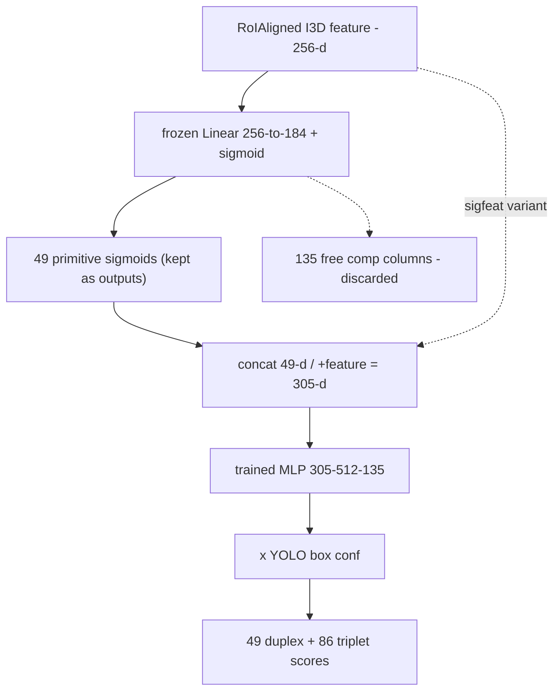

# Stacked Composition MLP

Brandon's design (2026-08-26): compositional classes (duplex/triplet) are
predicted by a small MLP that consumes the primitive heads' own predictions
plus the pooled feature, replacing free compositional output columns. The
component that completed the exp11 full six-head sweep
([[findings/exp11-yolo-hybrid]]).

## Architecture

Per detected box:
1. Frozen record head: Linear(256→184) + sigmoid over the RoIAligned I3D
   feature → 49 primitive sigmoids (agentness 1 / agent 10 / action 22 /
   loc 16), **kept as final outputs**; the 135 free duplex/triplet columns
   are discarded.
2. MLP input: the 49 ungated primitive sigmoids; the winning `sigfeat`
   variant concatenates the 256-d feature (305-d).
3. MLP: Linear({49|305}→512) + ReLU + Linear(512→135) + sigmoid → 49 duplex
   + 86 triplet scores in dataset label order.
4. Confidence gate: MLP sigmoids × YOLO box conf → final compositional
   scores.

## Training protocol (load-bearing)

Video-level 2-fold **out-of-fold stacking**: two throwaway fold heads
(identical recipe to the record head) generate each fold's input sigmoids, so
the MLP never trains on in-sample predictions — demanded by adversarial
review; in-sample stacking would confound the comparison. Focal loss with the
exp6 per-class alphas sliced to the 135 compositional dims. Trains in ~30 s
on cached rows. Checkpoint records head provenance (`head_ckpt`) and is
asserted against `--head` at eval.

## Results (full-candidate val, identical rows)

| composition source | duplex | triplet |
|---|---|---|
| **stacked MLP, sigfeat** | **15.52** | **9.73** |
| stacked MLP, sig only | 13.37 | 8.93 |
| end-to-end baseline | 11.32 | 7.54 |
| free learned columns | 11.13 | 6.65 |
| fixed product / Gödel min | 10.58 / 10.36 | 6.05 / 5.52 |

## Properties

- **Zero composed-label violations by construction**: the output vocabulary
  *is* the valid set (49/86) — invalid compositions have no output neuron.
  Hard structural constraint, no λ, no action-head collateral (contrast the
  λ=10 soft-penalty cell: action 3.43). See
  [[concepts/neuro-symbolic-constraints]].
- Learns co-occurrence priors fixed t-norm composition discards (Car-Stop =
  38% of duplexes) and profitably exceeds the Gödel min cap.
- Lineage: stacked generalization (Wolpert 1992); scene-graph / HOI
  compositional prediction (co-occurrence exploitation à la Neural Motifs).
  Novelty is the application + the controlled composition ladder, not the
  mechanism.

## Related

- [[findings/exp11-yolo-hybrid]] — results and the composition ladder
- [[concepts/neuro-symbolic-constraints]] — constraint-mechanism context
- [[methods/3d-retinanet]] — the end-to-end baseline it beats
